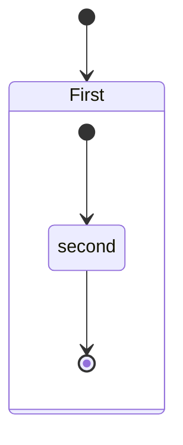
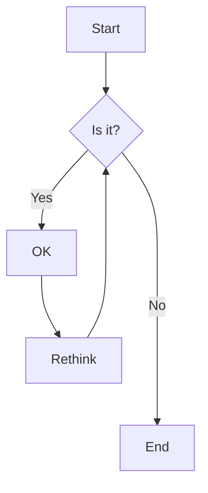

<a name="top"></a>


# Markdown - Test Simple

## Bloques de Código
### Tabulación (línea a línea)

    <!--Mi HTML-->
    <h1> este es mi codigo</h1>

### Triple acento invertido (**\`\`\`**)  
Se usa antes y después del bloque:
```
//mi código en Dart , C, C++, etc
void retornar(){
    return;
}
```
Este método es más práctico sobre todo cuando hay que añadir indentado.

## Líneas de División

Se pueden crear lineas de división co nasteriscos, guiones y guiones bajos

    ---
    ***
    ___

---
***
___

## Negrita, itálica y tachado

```
*Texto en cursiva*
_Texto en cursiva_
**Texto en negrita**
__Texto en negrita__
***Texto en cursiva y negrita***
___Texto en cursiva y negrita___

```

Para tachar rodear con dos virguillas seguidas (~):
~~Este texto está tachado.~~


## Texto en color
MarkDown no incluye por sí mismo opciones de color, sin embargo algunos lectores de MD aceptan el coloreo de texto insertando código HTML o propiedades CSS o incluso del *background*. Algunas opciones posibles:

### Insertando código HTML:

    <font color='red'>Texto en *rojo*</font>

<font color='red'>Texto en *rojo*</font>

    Markdown con <span style="color:green">algo de texto en *verde*</span>.

Markdown con <span style="color:green">algo de texto en *verde*</span>.

### Estilos con código CSS:
Se crean etiquetas personalizadas para rodear el texto a colorear. 

```
<style>
r { color: Red } 
o { color: Orange }
g { color: Green }
AM { background: Yellow }
</style>
<r>ROJO</r>
<o>VERDE</o> 
<g>NARANJA</g> 
<Y><r>remarcado</r></Y> 
```
<style>
r { color: Red } 
o { color: Orange }
g { color: Green }
Y { background: Yellow }
</style>
<r>ROJO</r>
<o>VERDE</o> 
<g>NARANJA</g> 
<Y><r>remarcado</r></Y> 

Estos métodos sirven también para remarcar el texto

## Listas
1. Primero
2. Segundo
3. Tercero
```
1. Primero
2. Segundo
3. Tercero

## Viñetas
```
- Primero
- Segundo
- Tercero
```
- Primero
- Segundo
- Tercero
```

## Casillas Verificacion

[ ]  A
[x]  B
[ ]  C

## Imagen 

### local, forma MD (suele tener problemas):


### local, forma HTML (funciona mejor) (con marco añadido)

<kbd>
<image src='../Imagenes/2B y 9S.jpg' alt="2B y 9S" >
</kbd>

### Enlace, forma MD


(puede ponerse la linea al estilo HTML)

### Tabla sencilla

El maquetado de las tablas se realiza con barras verticales (|) y guiones (-).

```markdown
| Columna 1 | Columna 2 | Columna 3 |
|:------ | :-------:| ------:|
| A      | $\alpha$ |  1     |
| B      | $\beta$  |  2     |
| C      | $\gamma$ |  3     |
```
Así se ve la tabla creada:

| Columna 1 | Columna 2 | Columna 3 |
|:------ | :-------:| ------:|
| A      | $\alpha$ |  1     |
| B      | $\beta$  |  2     |
| C      | $\gamma$ |  3     |

El uso de los dos puntos (**:**) en los lados de los guiones bajos en la segunda fila es opcional. Éste afecta a la alineacion de los elementos de la columna:
 
 - Puntos a la izquierda $\rightarrow$ alineacion izquierda
 - Puntos a la derecha $\rightarrow$ alineacion derecha
 - Puntos a ambos lados $\rightarrow$ elementos centrados

## Caracteres Reservados: & y < >

Se escribe

```markdown
A & B
α
1 < 2
<p>
```

Se ve:

A & B

&alpha;

1 < 2

<p>

## Simbolos de marcado

```
Asterisco: *
Guion: -
Guion bajo: _
Paréntesis: ()
Corchetes: []
Llaves: {}
Punto: .
Signo de exclamación: !
Almohadilla: #
Acento grave: `
Barra invertida: \
```

Esos simbolos se muestran con la barra invertida ( \ )

## Citas

Se hacen con el corchete triangular (>) al comienzo del texto.

> Wikipedia siempre pide citas.


## Notas al Pie

Puedes colocar [^1] notas en el pie de página [^2] fácilmente.


[^1]: Aquí encuentras el texto de la nota al pie de página.
    
[^2]: **Las notas de pie de página** pueden *formatearse* también.
    Estas pueden ocupar varias líneas.


## Referencias

[Tutorial de MarkDown](https://https://www.ionos.es/digitalguide/paginas-web/desarrollo-web/tutorial-de-markdown/)

[Insertar Imágenes](https://denshub.com/es/hugo-post-insert-image/)


[Fórmulas!!!](https://programmerclick.com/article/9139292621/)


## Ir a secciones


Con etiquetas HTML se pueden marcar ubicaciones especificas e ir a ellas con un simple click:

    <a name="top"></a>      # Esta etiqueta va en el lugar de destino
    ...

    [Subir al inicio](#top) # Enlace al destino

Haciendo etiquetas con distintos nombres se pueden implementar saltos a distintos lugares


https://learn.microsoft.com/es-es/contribute/content/how-to-write-links


    ## <a name="anchortext" />Header text


    To go to a section on the same page:
    [text](#anchortext)

    To go to a section on another page.
    [text](filename.md#anchortext)


Markdown acepta links a los titulos del documento. Ejemplo:

    [Notas al pie](#notas-al-pie)
    
    [Ir a secciones](#ir-a-secciones)


## Mermaid

Pagina oficial:
http://mermaid.js.org/intro/

https://emersonbottero.github.io/mermaid-docs/intro/n00b-syntaxReference.html

Extension VSCode/Codium recomendada:
https://open-vsx.org/extension/bierner/markdown-mermaid

Mermaid para JS:
https://swimm.io/learn/mermaid-js/mermaid-js-a-complete-guide

Mermaid sirve para crear diagramas de bloques desde bloques de texto:

```
stateDiagram
    [*] --> First
    state First {
        [*] --> second
        second --> [*]
    }
```




```
graph TD;
    A-->B;
    A-->C;
    B-->D;
    C-->D;
```


```
flowchart TD
    A[Start] --> B{Is it?}
    B -->|Yes| C[OK]
    C --> D[Rethink]
    D --> B
    B ---->|No| E[End]
```




## Marp
https://markmap.js.org

[Notas al pie](#notas-al-pie)

[Ir a secciones](#ir-a-secciones)


[Subir al inicio](#top)