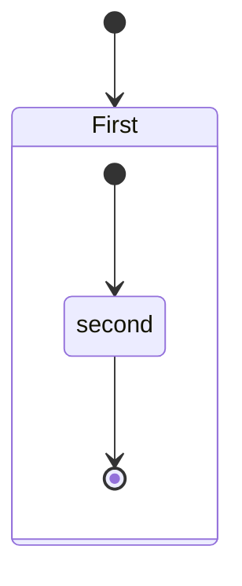
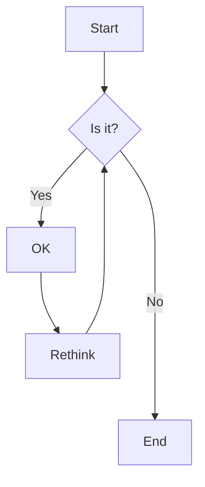

## Caracteres Reservados: & y < >

Se escribe

```markdown
A & B
α
1 < 2
<p>
```

Se ve:

A & B

&alpha;

1 < 2

<p>


## Simbolos de marcado

```
Asterisco: *
Guion: -
Guion bajo: _
Paréntesis: ()
Corchetes: []
Llaves: {}
Punto: .
Signo de exclamación: !
Almohadilla: #
Acento grave: `
Barra invertida: \
```

Esos simbolos se muestran con la barra invertida ( \ )


## Casillas Verificacion

- [ ]  A  
- [x]  B  
- [ ]  C


## Notas al Pie

Puedes colocar [^1] notas en el pie de página [^2] fácilmente.


[^1]: Aquí encuentras el texto de la nota al pie de página.
    
[^2]: **Las notas de pie de página** pueden *formatearse* también.
    Estas pueden ocupar varias líneas.


## Referencias

[Tutorial de MarkDown](https://https://www.ionos.es/digitalguide/paginas-web/desarrollo-web/tutorial-de-markdown/)

[Insertar Imágenes](https://denshub.com/es/hugo-post-insert-image/)


[Fórmulas!!!](https://programmerclick.com/article/9139292621/)


## Mermaid

Pagina oficial:
http://mermaid.js.org/intro/

https://emersonbottero.github.io/mermaid-docs/intro/n00b-syntaxReference.html

Extension VSCode/Codium recomendada:
https://open-vsx.org/extension/bierner/markdown-mermaid

Mermaid para JS:
https://swimm.io/learn/mermaid-js/mermaid-js-a-complete-guide

Mermaid sirve para crear diagramas de bloques desde bloques de texto:

```
stateDiagram
    [*] --> First
    state First {
        [*] --> second
        second --> [*]
    }
```




```
graph TD;
    A-->B;
    A-->C;
    B-->D;
    C-->D;
```


```
flowchart TD
    A[Start] --> B{Is it?}
    B -->|Yes| C[OK]
    C --> D[Rethink]
    D --> B
    B ---->|No| E[End]
```




## Marp
https://markmap.js.org

[Notas al pie](#notas-al-pie)

[Ir a secciones](#ir-a-secciones)


