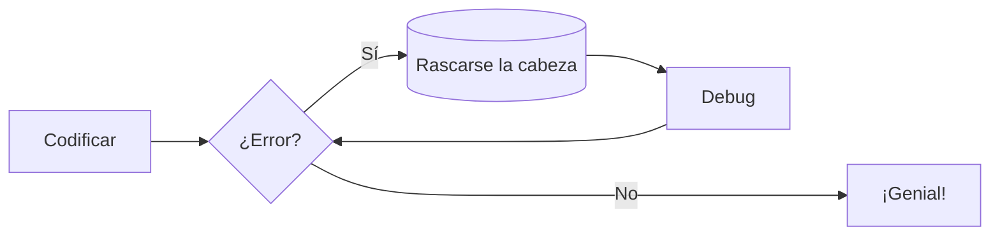
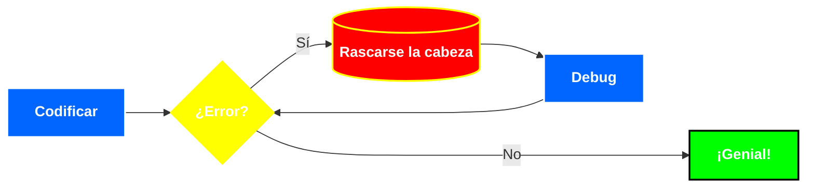

---
tags:
#   - HTML5
#   - JavaScript
  # - CSS
  - YAML
  - MkDocs
  - Python
#   - Docker
#   - Podman
  - Markdown
#   - TypeScript
---


# Diagramas


MkDocs trae incorporado el soporte para Mermaid.js, una herramienta que sirve para renderizar desde texto diagramas de flujo, diagramas de entidad-relación, etc.
Esta herramienta es externa y MkDocs lo carga vía CDN.


Más sobre Mermaid.js: [página oficial.](https://mermaid.js.org/)

## Habilitación

Mermaid.js necesita ser habilitado para que MkDocs realice el renderizado de las gráficas. Para ello hay que agregar al archivo de configuración:

``` yaml title="Habilitación de diagramas Mermaid"
# archivo "mkdocs.yml"
markdown_extensions:
  - pymdownx.superfences:
      custom_fences:
        - name: mermaid
          class: mermaid
          format: !!python/name:pymdownx.superfences.fence_code_format
```


## Uso

Los diagramas de Mermaid se escriben dentro de bloques de código, indicándose el identificador `mermaid`:

``` md title="Diagrama de flujo" hl_lines="1"
  ```mermaid
  graph LR
    A[Codificar] --> B{¿Error?};
    B -->|Sí| C[(Rascarse la cabeza)];
    C --> D[Debug];
    D --> B;
    B ---->|No| E[¡Genial!];
  ```
```

El resultado es el mostrado a continuación:



Nótese que el color usado para dibujar los bloques es el asignado para el remarcado (propiedad `accent`) de MkDocs. Esto puede ser modificado dentro del bloque del diagrama Mermaid.


```md title="Diagrama de flujo - Colores personalizados" 
  ```mermaid
  graph LR

    classDef error fill:#f00,color:white,font-weight:bold,stroke-width:2px,stroke:yellow
    classDef eval fill:#ff0,color:white,font-weight:bold,stroke-width:2px,stroke:yellow
    classDef debug fill:#06f,color:white,font-weight:bold,stroke-width:2px,stroke:white
    classDef exito fill:#0f0,color:white,font-weight:bold,stroke-width:2px,stroke:black

    A[Codificar] --> B{¿Error?}:::eval
    B -->|Sí| C[(Rascarse la cabeza)]:::error
    C --> D[Debug]:::debug
    D --> B;
    B ---->|No| E[¡Genial!]:::exito
    A:::debug
  ```
```

Así queda el diagrama con los estilos asignados:




## Tipos de diagramas 

MkDocs da soporte a los siguientes tipos de diagramas:

- Diagrama de flujo;
- Diagrama de estado;
- Diagrama de secuencias;
- Diagrama de entidad-relación.

En cambio, hay otros tipos de diagramas implementados por Mermaid.js 
que no tienen una buena visualizacion en dispositivos móviles,
los cuales son:

- Gráfico circular (*pie charts*);
- Diagramas de tareas(*gantt charts*); 
- Mapa de viaje (*user journeys*);
- Graficas de Git (*git graphs*), 
- Diagramas de requisitos(*requirement diagrams*).


## Referencias

[Sitio oficial de Material for MkDocs - Diagramas](https://squidfunk.github.io/mkdocs-material/reference/diagrams/)


[Sitio oficial de Mermaid.js - Diagramas de Estados](https://mermaid.js.org/syntax/stateDiagram.html)